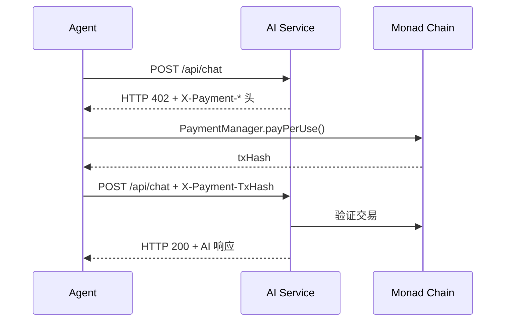

# AgentXPay Skill

[English](./README_EN.md) | 简体中文

让 AI Agent 在 **Monad** 区块链上自主完成服务发现、链上支付、钱包管理和订阅，基于 [x402 协议](https://www.x402.org/)实现全自动化 Agent-to-Agent 支付。

## x402 协议流程

## 7 个 Tools

| Tool | 说明 |
|------|------|
| `agentxpay_discover_services` | 链上服务发现，按类别/价格过滤 |
| `agentxpay_pay_and_call` | x402 核心 — 自动付费调用 AI 服务端点 |
| `agentxpay_smart_call` | 一步到位 — 发现 → 选最优 → 付费 → 调用 |
| `agentxpay_manage_wallet` | Agent 智能钱包管理（创建/充值/查询/设限额） |
| `agentxpay_subscribe` | 订阅 AI 服务周期性计划 |
| `agentxpay_create_escrow` | 为定制任务创建链上资金托管 |
| `agentxpay_get_agent_info` | 查询 Agent 钱包地址、余额、网络信息 |
