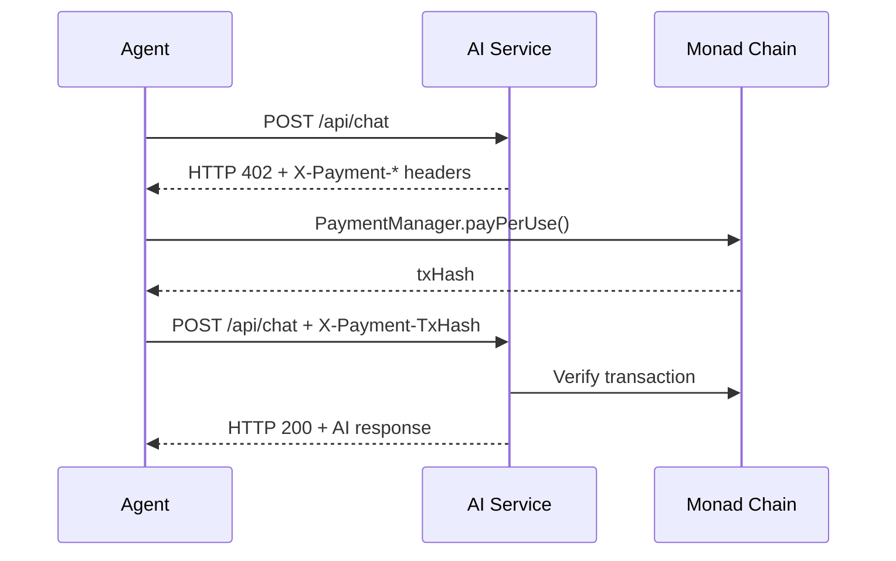

# AgentXPay Skill

English | [简体中文](./README.md)

Enable AI Agents to autonomously discover services, make on-chain payments, manage wallets, and subscribe on the **Monad** blockchain, powered by the [x402 protocol](https://www.x402.org/) for fully automated Agent-to-Agent payments.

## x402 Protocol Flow

## 7 Tools

| Tool | Description |
|------|-------------|
| `agentxpay_discover_services` | On-chain service discovery with category/price filters |
| `agentxpay_pay_and_call` | x402 core — auto-pay and call AI service endpoints |
| `agentxpay_smart_call` | All-in-one — discover → select best → pay → call |
| `agentxpay_manage_wallet` | Agent smart wallet management (create/deposit/query/set limits) |
| `agentxpay_subscribe` | Subscribe to AI service periodic plans |
| `agentxpay_create_escrow` | Create on-chain fund escrow for custom tasks |
| `agentxpay_get_agent_info` | Query agent wallet address, balance, and network info |
